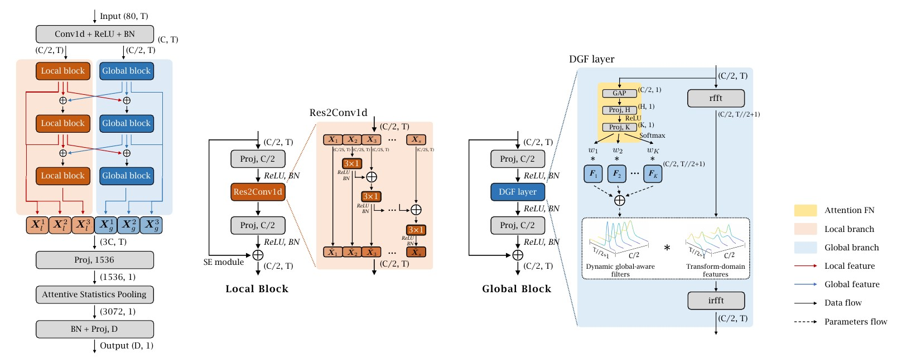

<!DOCTYPE html>
<html>
<body>
<h2>About me</h2>

I am currently pursuing the M.S. degreer at Huaqiao University (Supervisor: Xiaodan Lin). I've received the bachelor degree from FuZhou University, in 2020.

My research interests mainly include deep generative models, image processing, speech processing, multi-model learning, and representation learning.

<h2>Preprints</h2>

<i>DS-TDNN: Dual-stream Time-Delay Neural Network with Dynamic Global Filter for Speaker Verification</i> 
<b>Yangfu Li</b>, Xiaodan Lin* 
Submitted to IEEE/ACM Transactions on Audio, Speech, and Language Processing (TASLP) 
 
<i>PSVRF: A Learning-based Framework to Restore Pitch-shifted Voice for Speaker Identification</i> 
<b>Yangfu Li</b>, Xiaodan Lin* 
Submitted to INTERSPEECH, 2023 
 
<h2>Publications</h2>
<i>DeflickerCycleGAN: Learning to Detect and Remove Flickers in a Single Image</i> 
Xiaodan Lin, <b>Yangfu Li</b>, Jianqin Zhu, Huanqiang Zeng* 
IEEE Transactions on Image Processing (TIP) 
 
<i>A Conv-Attention Network for Detecting the Presence of ENF Signal in Short-Duration Audio</i> 
<b>Yangfu Li</b>, Xiaodan Lin*, Yinqiang Qiu, Huanqiang Zeng 
IEEE International Workshop on Multimedia Signal Processing (MMSP), 2022 
  
</body>
</html>

